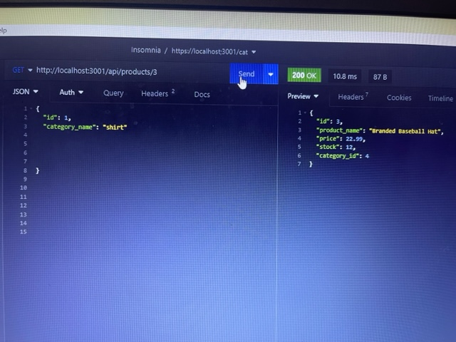

##   TITLE-- E-Commerce-Backend  ----

## License:
    MIT  

## Table of contents:
  - [Description](#description)
  - [Installation](##installation)
  - [Usage](#usage)
  - [Contribution](#Contribution)
  - [Testing](#Testing)

  ## Demo:
https://drive.google.com/file/d/18KDETXnxrKOrMihuPYp-zcSYIlQj3wsl/view

## Github link:

https://github.com/phvania/E-Commerce-Backend

  ##screenshot:

.jpg>)
 
 
 
 
 

## Description:
This application creates the backend of a e-comerce website by useing Express.js API and Sequelize to interact with a MySQL database.

## User Story

AS A manager at an internet retail company
I WANT a back end for my e-commerce website that uses the latest technologies
SO THAT my company can compete with other e-commerce companies

## Acceptance Criteria

GIVEN a functional Express.js API
WHEN I add my database name, MySQL username, and MySQL password to an environment variable file
THEN I am able to connect to a database using Sequelize
WHEN I enter schema and seed commands
THEN a development database is created and is seeded with test data
WHEN I enter the command to invoke the application
THEN my server is started and the Sequelize models are synced to the MySQL database
WHEN I open API GET routes in Insomnia for categories, products, or tags
THEN the data for each of these routes is displayed in a formatted JSON
WHEN I test API POST, PUT, and DELETE routes in Insomnia
THEN I am able to successfully create, update, and delete data in my database

## Usage:

Type the following command you are going to use in your  termimal: mysql -u root -p -- connect to your database and then run:

source schema.sql

Quit mySQL shell. Run the following command to seed the files:

npm run seed.

Then run:

npm start

 ## Installation:

 npm init

npm install mysql2

npm install sequelize

npm install dotenv

 ## Contribution:
 N/A

 ## Test:
 No testing is currently set up

 ## Questions:
  Contact me with any questions: email , GitHub
  vaniapriti@gmail.com
  phvania
